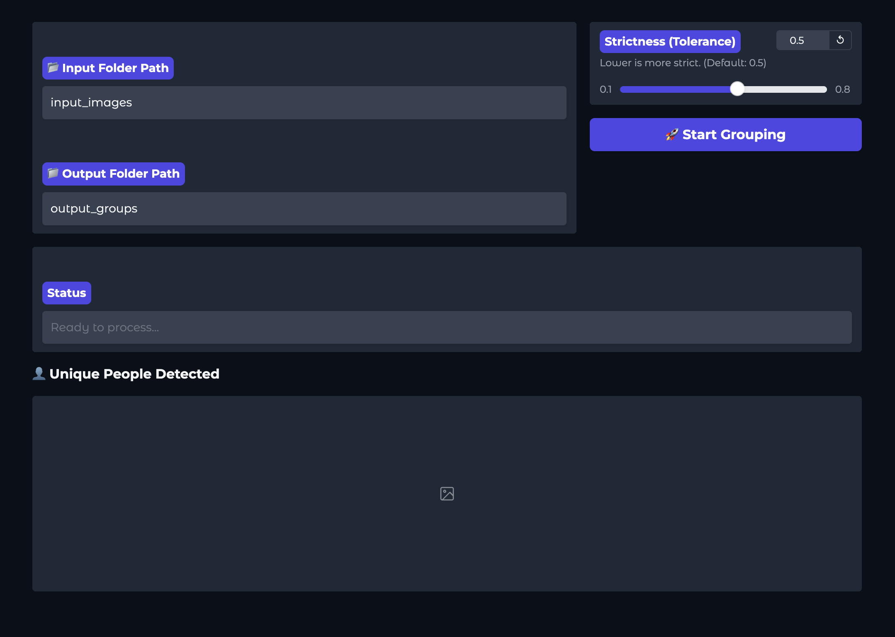

# 顔グループ化ツール (Face Grouper)


| [English](../README.md) | [廣東話](README.yue.md) | [繁體中文](README.zh-TW.md) | [简体中文](README.zh.md) | [日本語](README.ja.md) | [한국어](README.ko.md) |
| :---: | :---: | :---: | :---: | :---: | :---: |
| [Français](README.fr.md) | [Español](README.es.md) | [Indonesian](README.id.md) | [हिन्दी](README.hi.md) | [Tiếng Việt](README.vi.md) | [ภาษาไทย](README.th.md) |

このツールは、画像内の顔を自動的に認識し、フォルダにグループ化します。

## 必要条件

- **オペレーティングシステム:** macOS, Linux, または Windows
- **Python バージョン:** `3.11.9` (`.python-version` に指定)
- **コアライブラリ:** `face_recognition`, `opencv-python`, `numpy`, `gradio`

## GUI



## インストールと実行

### 1. インストール
まず、仮想環境がセットアップされ、すべての依存関係がインストールされていることを確認してください。

#### macOS / Linux:
```bash
# 仮想環境の作成と有効化
python3 -m venv venv
source venv/bin/activate

# 依存関係のインストール
./venv/bin/python3 -m pip install -r requirements.txt
```

#### Windows:
```bash
# 仮想環境の作成と有効化
python -m venv venv
.\venv\Scripts\activate

# 依存関係のインストール
.\venv\Scripts\python -m pip install -r requirements.txt
```

### 2. ツールの実行
最高の体験のために、モダンな Web インターフェースの使用をお勧めします。

#### Web GUI の起動 (推奨):
- **macOS / Linux:** `./venv/bin/python3 app.py`
- **Windows:** `.\venv\Scripts\python app.py`

#### コマンドライン版の起動:
- **macOS / Linux:** `./venv/bin/python3 face_grouper.py`
- **Windows:** `.\venv\Scripts\python face_grouper.py`

## トラブルシューティング

### `ModuleNotFoundError: No module named 'face_recognition'`
これは通常、仮想環境の外でスクリプトを実行したときに発生します。必ず仮想環境の python パスを使用してください：
- `macOS/Linux: ./venv/bin/python3 app.py`
- `Windows: .\venv\Scripts\python app.py`

### `zsh: command not found: python`
macOS では、`python` の代わりに `python3` を使用してください。

### 処理が非常に遅い
顔認識は CPU 負荷が高い作業です。他の重いアプリケーションを閉じるか、より多くのコアを持つマシンを使用すると改善されます。

### 検出結果が良くない
UI の **Tolerance (Strictness)** スライダーを調整してみてください：
- **低め (例: 0.4):** より厳密になります。ツールが別々の人物を一つのフォルダに混ぜてしまう場合に使用してください。
- **高め (例: 0.6):** より緩やかになります。ツールが同一人物に対してフォルダを多く作りすぎる場合に使用してください。

## 貢献

貢献を歓迎します！このツールの改善にご協力いただける場合は、以下の手順をお願いします：
1. リポジトリをフォークする。
2. 新しい機能やバグ修正のためのブランチを作成する。
3. 変更内容を明記したプルリクエストを送信する。

## 仕組み

1. **スキャン**: 指定した入力フォルダ内のすべての画像をスキャンします。
2. **検出**: AI を使用して顔を検出し、各人物のユニークなシグネチャを生成します。
3. **グループ化**: 好みの厳密さに基づいて似た顔をクラスター化します。
4. **整理**: 出力ディレクトリにフォルダを作成し、画像をコピーします。
5. **UI**: 検出された人物のリアルタイムギャラリーを表示します。

*注意: 1枚の画像に複数の人物が含まれている場合、その画像は検出された各人物のフォルダにコピーされます。*


## ライセンス

このプロジェクトは MIT ライセンスの下でライセンスされています。詳細は [LICENSE](../LICENSE) ファイルをご覧ください。